# Project 2 Research Report

Author: Yigu Wang

Date: 2026.01.06

## Choice of Potential

I selected the Cusp Potential as the primary subject of investigation, as it exhibits a sharp cusp singularity at $x=0$ that substantially influences wavefunction behavior. The mathematical form is:

$$
V(x) = V_0 |x|^{\alpha}, \quad 0 < \alpha < 1
$$

## Part A — Bound States and Wavefunction Structure

The first step is to numerically solve the bound states. I employ finite-difference discretization to convert the one-dimensional time-independent Schrödinger equation into a matrix eigenvalue problem. The implementation is in `quantum_tunneling/bound_states.py`, which constructs a sparse matrix and uses SciPy's eigenvalue solver.

### Setup and Solution Procedure

Open `part_a_bound_states.ipynb`, configure the grid parameters (`L` and `N`), and select the potential to study (I chose Cusp, but Exponential well or Soft-barrier can also be tested). Running `run_bound_states(cfg)` yields a set of eigenvalues and corresponding eigenfunctions.

The returned results include:

- `E`: eigenvalues, sorted in ascending order
- `psi`: eigenfunctions, with each column representing a quantum state
- `metrics`: diagnostics for each state, such as mean position, standard deviation, and IPR (inverse participation ratio, higher values indicate more localization)
- `forbidden`: probability in the classically forbidden region, computed as the integral of $|\psi|^2$ where $V > E$

### Visualization of Potential and Eigenstates

First, I plot the potential shape and the eigenstate energies:

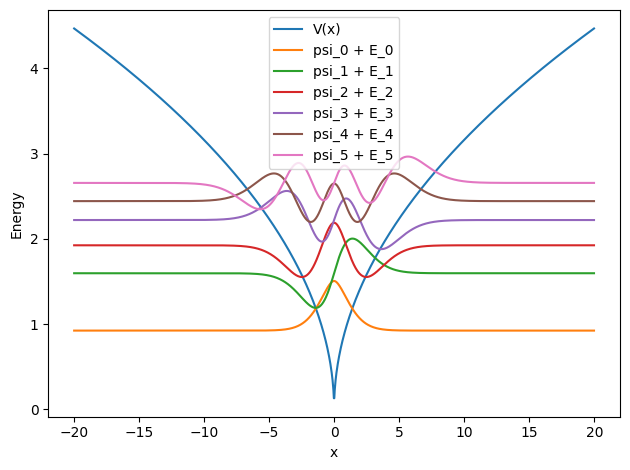

The plot shows that the Cusp potential has a singularity at $x=0$. Lower-energy states are tightly localized, while higher states begin to extend outward.

### Parameter Sweep: Potential Depth Dependence

To understand how the potential shape affects eigenstate properties, I performed a parametric scan over $V_0$, observing how the ground state width $\sigma$ and inverse participation ratio (IPR) change as the potential is strengthened.

Results show: as $V_0$ increases, the ground state becomes more compressed toward the center, $\sigma$ decreases, and IPR increases. This is intuitive—a steeper well confines the particle more effectively.

This animation demonstrates the ground state evolution as $V_0$ increases, illustrating the progressive contraction of the wavefunction.

### Forbidden-Region Probability

I examine how the probability in the classically forbidden region varies with quantum number $n$. This quantity reflects the extent to which the wavefunction "leaks" beyond the turning points.

An interesting result: probability in the forbidden region decreases as $n$ increases. I attribute this to the fact that the Cusp potential grows rapidly away from the origin, causing higher-energy states to remain predominantly confined within the well.

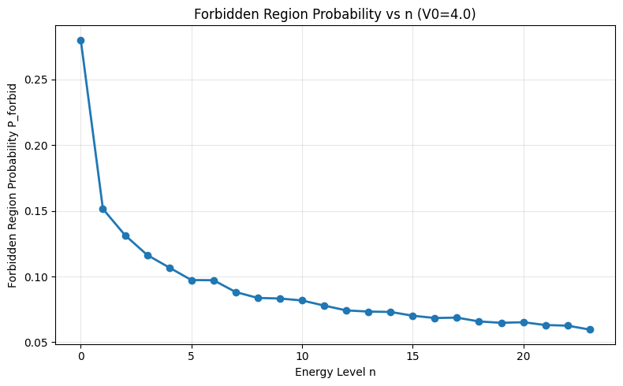

### Wavefunction Penetration Depth

I define a "penetration depth" as the distance over which the probability density decays from the classical turning point to $1/e$. I compute this quantity as a function of $n$.

Results indicate: penetration depth increases with $n$. This is because at higher energies, the Cusp potential becomes progressively softer (less steep), allowing the wavefunction to extend further into the forbidden region.

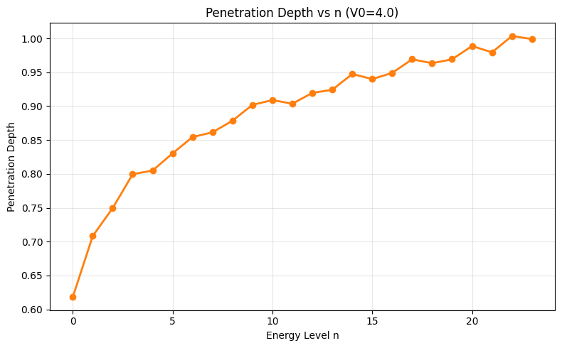

I also examine the spatial decay rate of the wavefunction in the forbidden region for each $n$.

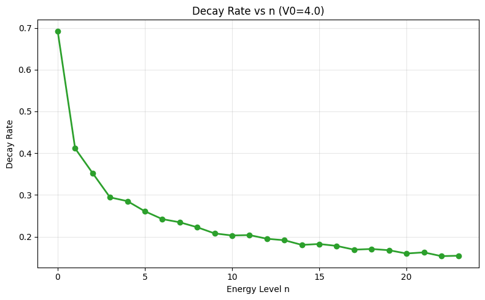

The same reasoning applies: at higher energy levels, the Cusp potential becomes less steep, so the wavefunction experiences weaker confinement in the classically forbidden region.

## Part B — WKB Tunneling in Exotic Potentials

> TBD

## Part C — Barrier Deformation Under External Field and Tunneling Properties

In this section, I apply a uniform external electric field $F$ to study how exotic barriers deform under tilting and to determine when over-barrier ionization occurs.

### Method

I apply a linear tilt to the potential: $V(x) \to V(x) - Fx$. I scan a series of field strengths $F$, computing the WKB transmission coefficient for each. The implementation is in `part_c_field_scan.ipynb`, with the core calculation performed by the `run_field_scan` function.

### Barrier Deformation Under External Field

First, I observe how the potential shape changes. As $F$ increases, the right-side barrier is progressively lowered until, at a critical field strength, the barrier maximum falls below the energy level and direct escape becomes possible.

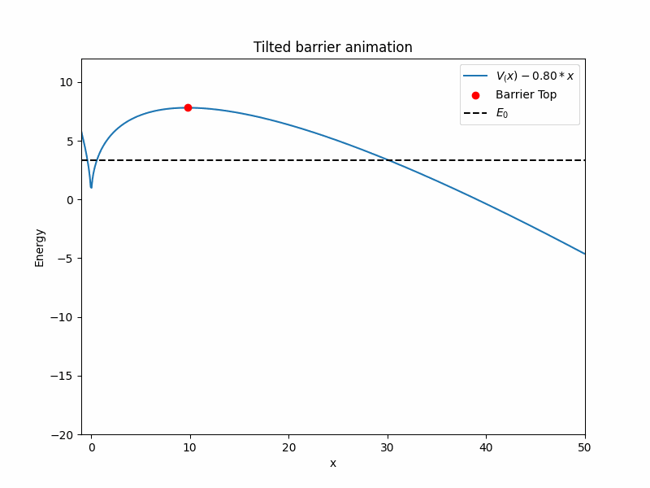

The animation shows how the Cusp potential is gradually tilted by the external field. The singularity at $x=0$ persists (characteristic of singular barriers), but the barrier height decreases rapidly.

### Transmission Coefficient vs. Field Strength

I examine how the WKB transmission coefficient $T_{\text{WKB}} = \exp(-2S/\hbar)$ varies with $F$.

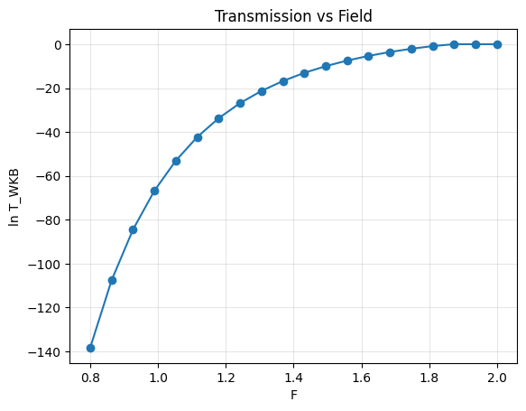

In the logarithmic plot, $\ln T$ increases with $F$, indicating increasing transmission. Note that beyond a critical field value ($F \approx 1.87$), $\ln T$ reaches zero, signifying over-barrier ionization with transmission probability approaching 1.

The linear plot more clearly shows a sharp increase in transmission above a certain $F$ threshold, corresponding to the transition from ultrasoft barrier to over-the-barrier regime. Finally, when $F \gtrsim 1.87$, over-barrier ionization occurs and transmission reaches 1.

### Critical Field Strength for Over-Barrier Escape

For the Cusp potential $V(x) = V_0|x|^{\alpha}$ subject to an external field, the barrier vanishes when the barrier top $V_{\text{top}} = E_n$. By finding the barrier maximum via differentiation and solving for the critical field, I obtain:

$$
F_{\text{ionization}} = \alpha \left( \frac{(1-\alpha)^{(1-\alpha)} V_0}{ E_n^{(1-\alpha)}} \right)^{1/\alpha}
$$

This formula is implemented in code cell 7 of the notebook.

### Escape Thresholds for Different Quantum States

Key finding: **higher-energy states escape more readily**.

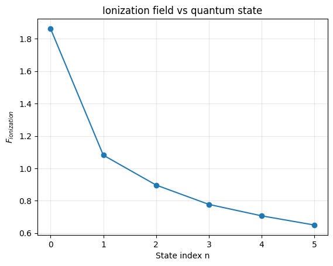

The plot shows that $F_{\text{ionization}}$ decreases monotonically as the quantum number $n$ increases. The physical intuition is straightforward: particles at higher energy require less external assistance to overcome the barrier.

Specific data come from code cell 8 output, with each excited state corresponding to a distinct ionization field. This implies that if one wishes to ionize a particular excited state via external field, considerably weaker field strengths are needed compared to ionizing the ground state. Such findings are relevant to atomic ionization experiments.

### Detailed Conditions for Ultrasoft and Singular Barriers

**Ultrasoft barrier formation:**

The barrier becomes ultrasoft when:

$$
V_{\text{top}}(F) \approx E_n, \quad \text{i.e.}, \quad F \lesssim F_{\text{ionization}}
$$

When $F_{\text{ionization}} - F \ll F_{\text{ionization}}$, the barrier height $\Delta V = V_{\text{top}} - E_n$ becomes very small. In this regime:

- The action integral $S = \int_{x_1}^{x_2} \sqrt{2m(V(x) - E_n)} \, dx$ approaches zero rapidly
- The WKB transmission $T_{\text{WKB}} = \exp(-2S/\hbar)$ approaches 1 rapidly
- However, this is not true "tunneling enhancement" but rather the barrier itself disappearing; the WKB formula becomes invalid

For the Cusp potential, the ultrasoft regime occurs near:

$$
F \approx F_{\text{ionization}} = \alpha \left( \frac{(1-\alpha)^{(1-\alpha)} V_0}{ E_n^{(1-\alpha)}} \right)^{1/\alpha}
$$

From my data, the ground-state ionization field is $F_{\text{ionization}} \approx 1.87$, so the barrier becomes appreciably flattened for $F > 1.8$.

**Singular barrier formation:**

Singularity is not caused by the external field but is an intrinsic property of the potential itself. For the Cusp potential:

$$
V(x) = V_0|x|^{\alpha}, \quad 0 < \alpha < 1
$$

The derivative at $x=0$:

$$
\frac{dV}{dx} = \alpha V_0 \text{sgn}(x) |x|^{\alpha-1} \to \infty \quad \text{as} \, x \to 0
$$

This infinite derivative (or cusp) persists even with the external field:

$$
V(x) - Fx = V_0|x|^{\alpha} - Fx
$$

The cusp remains at $x=0$. Therefore, the singular barrier condition is: **whenever $\alpha < 1$ in the Cusp potential, the singularity is always present**.

This has numerical implications:

- When classical turning points are close to $x=0$, the steepness of $\sqrt{V(x) - E}$ causes numerical instability in WKB integration
- Higher-order WKB corrections (involving the second derivative of the potential) diverge at the cusp

**Relationship between ultrasoft and singular barriers:**

Ultrasoft and singular barriers represent two independent issues:

- **Ultrasoft** is field-induced and controllable (by varying $F$); it disappears once $F$ exceeds $F_{\text{ionization}}$
- **Singular** is an intrinsic property of the potential; it is unavoidable and present for all $F$

## Part D — Time-Dependent Schrödinger Equation Dynamics (TDSE)

In Part D, I focus on temporal dynamics by directly solving the time evolution of the wavefunction using the Split Operator + FFT method, thereby extracting escape rates and probability flux. The one-dimensional TDSE employed is:

$$
i\hbar\,\frac{\partial \psi(x,t)}{\partial t}
=\left[-\frac{\hbar^2}{2m}\frac{\partial^2}{\partial x^2}+V(x)-Fx\right]\psi(x,t)
$$

The main workflow is implemented in `part_d_tdse_v2.ipynb`: I first compute the stationary eigenstates to serve as initial conditions, then replace the potential with the tilted form $V(x)-Fx$, and finally evolve the wavefunction using the Split Operator + FFT method.

### Representative Parameters

I fix a potential function and grid parameters to ensure numerical stability:

- Potential: Cusp, $V(x)=V_0|x|^{\alpha}$, for example `V0=10.0, alpha=0.5`
- Spatial grid: `L=100.0, N=1200`
- External field: for example `F=1.5`
- Time stepping: `dt=0.002, duration=64.0, record_interval=25`
- Absorbing boundary condition (CAP): complex absorbing potential near boundaries to suppress reflections (configured in `cfg['tdse']['cap']`)

All configuration and parameters are in `part_d_tdse_v2.ipynb` in the 2nd code cell: `cfg = {...}`. The main purpose of the CAP is to absorb the wavefunction before it reaches the boundary, preventing boundary reflections that would propagate back into the well region and contaminate the escape rate estimate.

The tilted potential and initial wavefunction eigenstates are shown below:

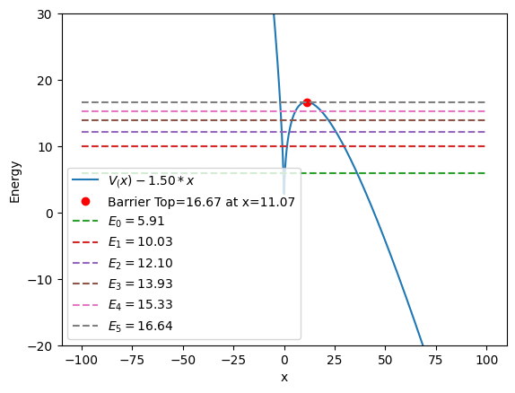

### Defining Escape via Intra-Well Survival Probability $P_{\text{inwell}}(t)$

Note: in this section I focus on a single eigenstate with `state_index=3` (the 4th energy level). Running TDSE produces a series of time frames `frames`, each containing a wavefunction $\psi_{3,\text{frame}}(x)$.

The survival probability $P_{\text{inwell}}(t)$ (more precisely, the probability contained within the well region) is defined as:

$$
P_{\text{inwell}}(t)=\int_{x\le x_{\text{top}}} |\psi(x,t)|^2\,dx
$$

where $x_{\text{top}}$ is the barrier maximum of the tilted potential. I define the intra-well region as $x\le x_{\text{top}}$. This definition is straightforward to implement, numerically stable, and permits cross-validation with the flux-based analysis.

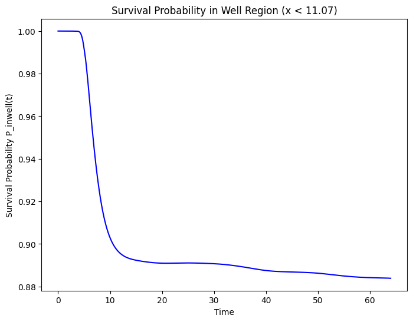

### Extracting Escape Rate $\Gamma$ via Exponential Fit

If escape can be approximated as a constant-rate process over a time interval, then:

$$
P_{\text{inwell}}(t)\approx A\,e^{-\Gamma t}\quad\Rightarrow\quad \ln P_{\text{inwell}}(t)\approx \ln A - \Gamma t
$$

I do not fit from $t=0$, but instead use the latter half of the frames (`last_n = int(len(frames)*0.5)`). The reason is that the initial state is not an eigenstate of the tilted potential, so an early-time transient exists. For the latter half of the data, I perform linear regression of $\ln P_{\text{inwell}}$ versus $t$ using `scipy.stats.linregress`; the negative slope gives the escape rate $\Gamma$.

The present fit yields: $\Gamma \approx 0.0002201422482195$.

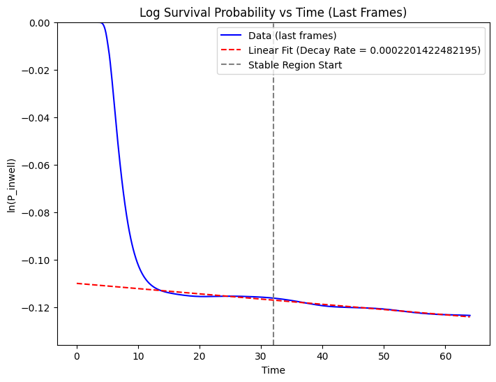

### Probability Flux: Current Density at Barrier Top

Beyond integrating survival, I also directly observe the outward flow. For a one-dimensional wavefunction, the probability current density is:

$$
j(x,t)=\frac{\hbar}{m}\,\mathrm{Im}\left(\psi^*(x,t)\,\partial_x\psi(x,t)\right)
$$

I compute the spatial derivative using `np.gradient` to obtain the discrete array $j(x)$ (see [`probability_flux`](quantum_tunneling/tdse.py) / [`probability_current`](quantum_tunneling/observables.py)). I then extract the flux at the grid point corresponding to the barrier top $x_{\text{top}}$, yielding a time-dependent flux sequence $j(x_{\text{top}},t)$.

To relate this to survival, I plot $j(x_{\text{top}},t) / P_{\text{inwell}}(t)$. Within the stable region where exponential decay is valid, this ratio should approach a constant, providing an independent cross-check of $\Gamma$.

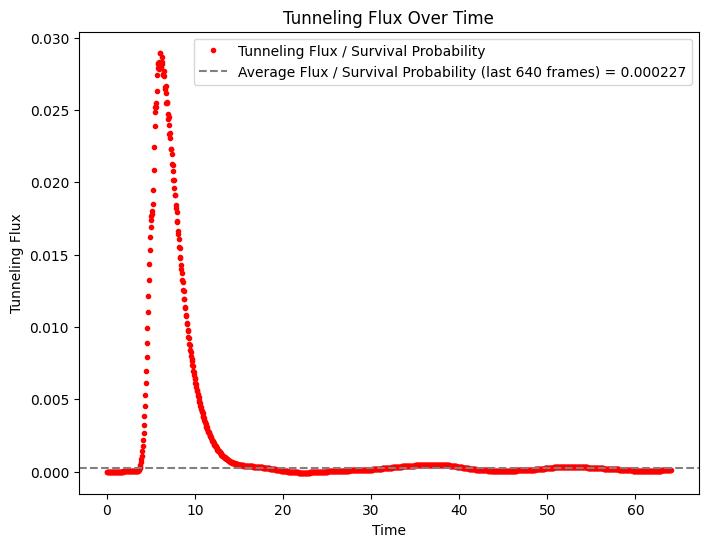

### Wavefunction Time Evolution Animation: Direct Inspection of Escape Dynamics

A single survival curve alone cannot reliably distinguish genuine escape from numerical artifacts (norm loss, boundary reflection, etc.). Accordingly, I produced a time-evolution animation overlaying the tilted potential, energy levels, and the real part, imaginary part, and probability density of $\psi$, allowing visual inspection of the dynamics.

The animation is generated using `matplotlib.animation.FuncAnimation` and saved as a gif (via `ani.save(...)` in the notebook). Two key aspects are monitored:

- Whether the wavefunction exhibits sustained outward flow beyond the barrier and is effectively absorbed in the CAP region
- Whether the CAP acts primarily at the boundaries without introducing spurious distortions to the intra-well waveform

### Deviations from WKB: $\ln\Gamma_{\text{TDSE}}$ vs. $S(E)$

Finally, I relate the numerically obtained escape rates to the WKB action. In the simplest WKB approximation:

$$
\Gamma \propto e^{-2S/\hbar}\quad\Rightarrow\quad \ln\Gamma \approx -\frac{2}{\hbar}S + \text{const}
$$

My procedure: for all eigenstates below the barrier top (`i in range(highest_bound_state)`), I run TDSE independently to extract $\Gamma_i$; simultaneously, for the same field $F$, I compute $S(E_i)$. I then plot the pairs $(S(E_i),\ln\Gamma_i)$ and perform a linear fit to assess whether the relationship is approximately linear.

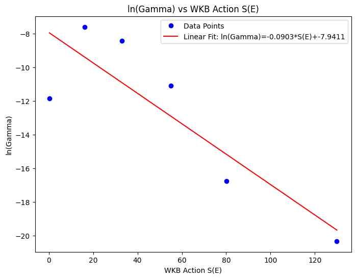

The present fit yields: $\ln\Gamma_n = -0.0903 \, S(E_n) - 7.9411$, with correlation coefficient $r \approx -0.86$, indicating a moderately strong negative correlation. The slope $\approx -0.0903$ deviates significantly from the theoretical expectation of $-2/\hbar = -2$. This discrepancy reflects the breakdown of the WKB approximation in regimes with singular potentials, where the slowly-varying assumption is violated near the cusp.
